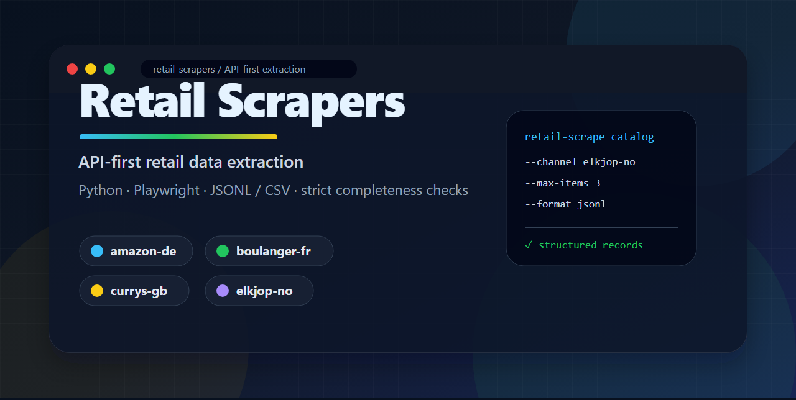

# Retail Scrapers

[English README](README.md)




面向真实零售网站的 API-first 商品目录与价格抓取工具箱。

这个项目只负责一件事：把公开网页或前端接口里的零售数据，稳定地转成结构化记录。数据库、价格历史、汇率换算、商品匹配、告警和可视化，都由使用者按自己的业务场景决定。

## 30 秒 demo

```bash
python -m pip install -e .
python -m playwright install chromium

retail-scrape catalog \
  --channel elkjop-no \
  --max-items 3 \
  --no-strict \
  --output output/elkjop.jsonl
```

示例输出：

```json
{"channel":"elkjop-no","country":"NO","sku":"123456","brand":"Example","title":"Example 55 inch 4K TV","url":"https://www.example.com/product/123456","price":7990.0,"currency":"NOK","availability":"in_stock"}
```

## 为什么做这个项目

很多爬虫示例停留在“打开网页、解析文本”。真实零售网站需要更稳的模式：

- API 优先：优先复用前端已经调用的结构化接口。
- 浏览器兜底：页面需要渲染或会话设置时使用 Playwright。
- 严格完整性检查：不要把半量目录伪装成成功。
- 渠道隔离：一个零售商改版，不应该拖垮所有 adapter。
- 不内置用户数据、Cookie、账号或私有商品映射。

## 已支持渠道

维护细节见 [渠道健康状态](docs/channel-health.zh-CN.md)，也可以运行：

```bash
retail-scrape health
retail-scrape health --format markdown
```

| 渠道 ID | 市场 | 目录 | 价格 | 主要策略 |
|---|---|---:|---:|---|
| `amazon-de` | 德国 | 是 | 是 | Playwright、配送地会话、EUR 校验 |
| `boulanger-fr` | 法国 | 是 | 是 | 品牌筛选、HTML 解析、Schema.org 兜底 |
| `currys-gb` | 英国 | 是 | 是 | 独立页面会话、Schema.org 兜底 |
| `elkjop-no` | 挪威 | 是 | 是 | Algolia 目录 API、tRPC 价格 API、页面兜底 |

零售网站经常改版，所以 adapter 是否健康，应以最近一次运行日志或 live smoke test 为准。

## 安装

```bash
python -m pip install -e .
python -m playwright install chromium
```

开发环境：

```bash
python -m pip install -e ".[dev]"
```

## 命令行使用

查看支持渠道：

```bash
retail-scrape channels
```

抓取 Elkjøp 指定年份的电视目录：

```bash
retail-scrape catalog \
  --channel elkjop-no \
  --year 2025 \
  --year 2026 \
  --output output/elkjop.jsonl
```

按品牌抓取 Amazon Germany 搜索目录：

```bash
retail-scrape catalog \
  --channel amazon-de \
  --brand Samsung \
  --brand Sony \
  --postal-code 10115 \
  --output output/amazon.csv \
  --format csv
```

按 URL 清单抓取价格：

```bash
retail-scrape prices \
  --channel currys-gb \
  --input examples/products.example.csv \
  --output output/prices.jsonl
```

输入文件至少包含 `id` 和 `url`：

```csv
id,url
product-1,https://www.example.com/product/1
product-2,https://www.example.com/product/2
```

默认启用严格模式。如果价格成功率低于 80%，或支持总量校验的目录抓取出现缺页，命令会返回非零退出码。探索或排障时可以使用 `--no-strict`。

通用运行参数：

- `--timeout-ms`：请求或页面导航超时时间，单位为毫秒。
- `--retries`：首次请求失败后的重试次数。
- `--delay-seconds`：重试、翻页或顺序访问商品之间的等待秒数。

## Python 用法

```python
from retail_scrapers import scrape_catalog

records = scrape_catalog(
    "elkjop-no",
    years=[2025, 2026],
)

for record in records:
    print(record.sku, record.price, record.currency)
```

异步应用可以使用 `retail_scrapers.runner` 中的 `scrape_catalog_async` 和 `scrape_prices_async`。

## 方便 fork 的 adapter 结构

想增加新的零售商，可以从这里开始：

```bash
retail-scrape scaffold example-shop-us \
  --display-name "Example Shop US" \
  --country US
```

这会生成 adapter 包和对应测试文件，让 fork 用户把精力放在提取逻辑上，而不是重复写样板代码。

- [架构说明](docs/架构说明.md)
- [新增渠道指南](docs/新增渠道.md)
- [API 发现手册](docs/api-discovery-playbook.zh-CN.md)
- [渠道健康状态](docs/channel-health.zh-CN.md)
- [Roadmap](ROADMAP.md)
- [示例输出](examples/output.example.jsonl)

每个零售商都放在 `src/retail_scrapers/adapters/` 下的独立 adapter 包里。解析逻辑应使用离线 fixture 测试；真实网站测试放在手动触发的 smoke workflow 中。

## 输出原则

- 保留网站原始币种，不默认做汇率换算。
- 不替用户匹配内部商品主数据。
- 不在包内持久化 Cookie、会话或抓取结果。
- `metadata` 只保存渠道公开返回的辅助字段。

## 使用边界

使用者需要自行确认目标网站服务条款、robots 规则和所在地法律要求。请控制请求频率，不访问需要登录或授权的数据，不采集个人信息，也不要使用本项目破坏网站服务。

## 开发

```bash
ruff check .
pytest
mypy src/retail_scrapers
```

真实抓取前，可以先检查本地环境：

```bash
retail-scrape doctor
```

## 许可证

MIT
